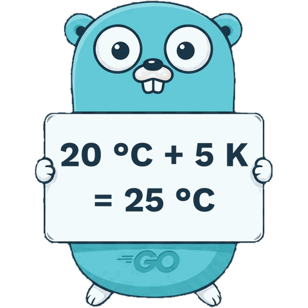

# metrology

[](https://github.com/timzifer/metrology/actions/workflows/ci.yml)
[](https://github.com/timzifer/metrology/actions/workflows/ci.yml)
[](https://pkg.go.dev/github.com/timzifer/metrology)

A Go library for physical quantities: exact decimal arithmetic, runtime
dimensional analysis, and one package per quantity so that autocompletion doubles
as a catalogue.

```go
p := pressure.Bar.Of(2.5)

pa, err := p.In[float64](pressure.Pascal)   // 250000
t, err  := temperature.Celsius.Of(20).
           Add(interval.Kelvin.Of(5))       // 25 °C

_, err = temperature.Celsius.Of(20).
         Add(temperature.Celsius.Of(5))     // error: adding two absolute values
```

```sh
go get github.com/timzifer/metrology
```

<br clear="right">

## What makes it different

**Exact conversions.** Magnitudes are decimals, not floats, and conversion
factors are stored as exact fractions — Fahrenheit as 5/9, Torr as 101325/760.
A conversion rounds once, by a documented rule, instead of inheriting the error
of a pre-rounded constant. `760 torr` is exactly `101325 Pa`.

**Absolute and relative quantities are distinguished.** 20 °C + 5 K is 25 °C.
25 °C − 20 °C is 5 K, an interval, not a temperature. 20 °C + 5 °C is an error,
because it is meaningless. The rules are explicit rather than special-cased for
temperature.

**Quantities that share a dimension stay apart.** The hertz and the becquerel are
both `T⁻¹`, the gray and the sievert both `L²T⁻²`, a plane angle and a bare ratio
are both dimensionless. Each carries the quantity it measures, so 50 Hz asked for
in becquerel is an error rather than 50 Bq. A computed magnitude carries no such
tag — a quotient of a force by an area knows only the exponents — so it can still
be named as whatever the caller means it to be.

**Dimensional errors say what went wrong.** Go cannot express dimensional
analysis in its type system — there are no integer type parameters, so a
`Q[Length, Time]` is not constructible. Rather than pretending otherwise, this
library checks at runtime and makes the error message carry its weight, naming
both dimensions.

**A `go vet` pass catches what is statically provable.** `unitvet` reads your
code and reports arithmetic and conversions across incompatible dimensions
without running it. It reports only what it can prove and stays silent
otherwise, so it composes with existing CI instead of producing noise. See
[below](#dimensions-are-checked-before-the-code-runs).

## The catalogue is data

Units are not written in Go. [`catalog/catalog.yaml`](catalog/catalog.yaml) is
the source of truth, and `go generate ./...` turns it into the quantity packages
and the catalogue index:

```yaml
- id: torr
  go: Torr
  doc: one 760th of the standard atmosphere
  symbol: {form: static, text: Torr}
  factor: {num: "101325", den: "760"}
  source: NIST SP 811 (2008), Appendix B.8
```

It holds **82 units across 43 quantity packages**: all seven SI base units, all
twenty-two named derived units, the CGS and legacy units that still appear in
data sheets, and the non-SI units of NIST SP 811 that process engineering uses.

Every entry carries a source, because a conversion factor is a claim about the
world and a claim without a citation cannot be checked. The generator refuses a
catalogue with a missing source, a duplicate symbol, two units claiming the same
dimension and quantity, or a factor that is not a number — at generation time, so
a defective catalogue is a failed build rather than a panic in production.

Every factor is **exact**, and units that cannot be exact are left out rather
than rounded in: the degree of arc is π/180 radians, which has no finite decimal
fraction, so it waits for symbolic factors instead of shipping as
`0.017453292519943295`. A golden test checks the whole catalogue against the
factors printed in NIST SP 811.

For the cases where the unit is not known at compile time — a symbol read from a
configuration file, or a computed dimension that needs a unit to be expressed
in — the `catalog` package indexes the same data:

```go
q, _ := force.Newton.Of(100).Div(area.SquareMetre.Of(2))            // 50 N/m²
unit, _ := catalog.Canonical(q.Dimension(), q.Kind(), q.Quantity()) // Pa
named, _ := q.To(unit)                                              // 50 Pa
```

## Text is the exchange format

A measurement writes itself as `"2.5 bar"` — the magnitude with every digit it
carries, and the unit it is held in. That is the whole serialisation format:
`MarshalText`, `MarshalJSON` and `driver.Valuer` on the measurement itself.

Reading it back needs a catalogue, because `bar` is a unit only because
something says so — and the library has no global registry to keep one in. A
parser is therefore a value holding the units it knows:

```go
m, _ := parse.Measurement("250 kPa")     // prefixes are read off the symbol
p, _ := parse.Measurement("50 N/m²")     // and expressions out of the operators
u, _ := parse.Unit("J/(kg·K)")

mine := parse.New(myUnits)               // your own units, same code
m2, _ := mine.Measurement("2.5 wdg")
```

Go's decoding interfaces — `encoding.TextUnmarshaler`, `json.Unmarshaler`,
`sql.Scanner` — are handed no context to resolve a symbol with, so the
destination carries the parser instead:

```go
var config struct {
    Setpoint   parse.Text `json:"setpoint"`   // "20 °C"
    Hysteresis parse.Text `json:"hysteresis"` // "2 K"
}
_ = json.Unmarshal(data, &config)
upper, _ := config.Setpoint.Add(config.Hysteresis.Measurement) // 22 °C

column := parse.Text{}.In(pressure.Bar)   // a NUMERIC column, unit in the schema
_ = row.Scan(&column)
```

Everything the library prints, it reads back — as the same unit, the same kind
and the same digits, across the whole catalogue. The parser is fuzzed against
that property.

## Dimensions are checked before the code runs

Go cannot express dimensional analysis in its type system, so this library
checks at run time — and ships a `go vet` pass that recovers the part of it a
compiler could have caught:

```sh
go install github.com/timzifer/metrology/cmd/unitvet@latest
go vet -vettool=$(go env GOPATH)/bin/unitvet ./...
```

```
app/app.go:12:33: Add on incompatible dimensions: L⁻¹M¹T⁻² and Θ¹
app/app.go:19:14: Add on incompatible kinds: absolute and absolute; the sum of two points on a scale is not a point on it
app/app.go:26:21: To on incompatible quantities: frequency and radioactivity
```

It resolves a unit through local variables, through the arithmetic that composes
units, and across package boundaries — a function that always returns the same
scale says so in a fact its callers read. Where it cannot resolve one, it says
nothing at all: a unit chosen in an `if`, one arriving as a parameter, one read
out of a map, or one from a catalogue of your own it has never seen. A dimension
checker with false positives is a dimension checker that gets switched off, and
then it catches nothing.

For the test that asserts an operation fails, a comment silences the report:

```go
//unitvet:ignore the assertion is that this conversion fails
_, err := frequency.Hertz.Of(50).To(activity.Becquerel)
```

The table of units the pass resolves against is generated from the same
`catalog.yaml` as the library, so the checker and the run time cannot drift
apart.

## Requirements

Go 1.27 or newer. The library uses generic methods, which are only available from
that release.

## Stability

The library is complete for the scope described above and CI is green: build,
`go vet`, the race detector, the dimension checker over its own source, and a
coverage gate at 100 % of hand-written statements.

The module is nevertheless tagged `v0.x`, and **the API may change until
`v1.0.0`.** What stands between here and there is a deliberate review of the
exported surface, not missing functionality; the open points are listed in
[section 7 of CONCEPT.md](CONCEPT.md#7-state-and-the-road-to-v100).

## Documentation

- [pkg.go.dev](https://pkg.go.dev/github.com/timzifer/metrology) — the API, with
  runnable examples for everything a caller touches.
- [CONCEPT.md](CONCEPT.md) — architecture, the fourteen design decisions and the
  reasoning behind them, what is deliberately deferred, and a verification log
  with reproduction steps for every measured claim.
- [CLAUDE.md](CLAUDE.md) — invariants and conventions for anyone (human or agent)
  changing this code.

## Development

```sh
go build ./...
go vet ./...
go test -race ./...

go test -covermode=atomic -coverpkg=./... -coverprofile=coverage.out ./...
go run ./tools/covercheck -profile coverage.out

go build -o /tmp/unitvet ./cmd/unitvet
go vet -vettool=/tmp/unitvet ./...
```

Adding a unit means editing `catalog/catalog.yaml` and running `go generate ./...`
— never editing a `*_gen.go` file.

The project targets 100 % statement coverage of hand-written code, enforced in
CI. Generated catalogue files are excluded; see D14 for what the target does and
does not claim.

The coverage badge above is written by the same run that enforces the gate:
`covercheck -badge` emits a [shields.io endpoint](https://shields.io/badges/endpoint-badge)
document, which CI publishes to the `badges` branch. The badge therefore shows
the number the gate measured, and no third-party service is involved.

## Licence

MIT. See [LICENSE](LICENSE).

The gopher is derived from the Go gopher by Renée French, licensed
[CC BY 4.0](https://creativecommons.org/licenses/by/4.0/).
